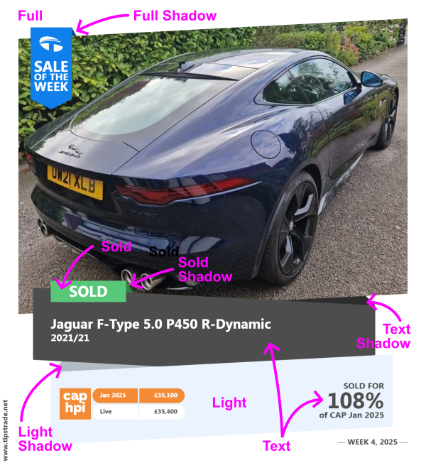
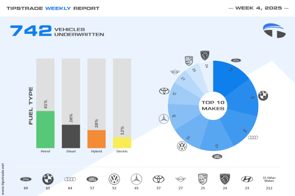

# Colour Schemes

This page is for reference only. For up-to-date usage, see the [Brand Toolkit](https://tipstrade.net/brand/colour).

## Website Colours

| Name | RGB | Hex | Notes |
| --- | --- | --- | --- |
| Blue | 15,127,235 | #0f7feb | The blue part of the TipsTrade roundel |
| Light Blue | 133,180,245 | #85b4f5 |
| Dark Blue | 50,102,183 | #3266b7|
| Light Grey | 241,241,241 | #f1f1f1 |
| Dark Grey | 77,77,77 | #4d4d4d | The grey/black part of the TipsTrade roundel |
| Emphasis (Yellow) | 248,237,86 | #f8ed56 |
| Success (Green) | 88,199,120 | #58c778 |
| Warning (Dark Orange) | 243,139,55 | #f38b37 |
| Danger (Red) | 255,58,58 | #ff3a3a |
| CAP HPI  (Dark Orange) | 243,139,55 | #f38b37 |

### Vehicle Status

| Name | RGB | Hex |
| ---- | --- | --- |
| Buy Now | 130,241,165  | #82f1a5  |
| Sale Price | 189,226,97   | #bde261  |
| Today     | 255,252,182  | #fffeb6  |
| Unopened  | 204,175,242  | #ccaff2  |
| Physical  | 187,228,255  | #bbe4ff  |
| Dealt     | 250,198,156  | #fac69c  |
| Underwrite| 255,255,255  | #ffffff  |
| Sold      | 252,149,175  | #fc95af  |
| Removed   | 133,133,255  | #8585ff  |

## Social Media 

### Report Type or Period

| Type | Full | | Shadow | | Light | | Light Sh. | |
| --- | --- | --- | --- | --- | --- | --- | --- | --- |
| Week | 15,127,235 | #0f7feb | 16,80,141 | #10508d | 235,244,254 | #ebf4fe | 179,187,194 | #b3bbc2 |
| Month | 144,101,188 | #9065bc | 79,52,106 | #4f346a | 241,235,246 | #f1ebf6 | 187,178,196 | #bbb2c4 |
| Quarter | 101,179,188 | #65b3bc | 59,118,125 | #3b767d | 235,245,246 | #ebf5f6 | 185,200,201 | #b9c8c9 |
| Year | 219,87,87 | #db5757 | 155,49,49 | #9b3131 | 255,242,242 | #fff2f2 | 214,192,192 | #d6c0c0 |
| Spotlight | 232,163,94 | #e8a35e | 155,102,49 | #9b6631 | 239,213,187 | #efd5bb | 209,184,158 | #d1b89e |

#### Other Colours
| Type | Full | | Shadow | |
| --- | --- | --- | --- | --- |
| Text | 77,77,77 | #4d4d4d | 45,45,45 | #2d2d2d |
| Sold Tag | 44,135,70 | #2c8746 | 88,199,120 | #58c778 |
| Background | 255,255,255 | #ffffff | | |
| Bar Background | 223,223,223 | #dfdfdf | | |

#### Fuel Colours
| Fuel | B/ground | | F/ground | |
| --- | --- | --- | --- | --- |
| Petrol | 88,199,120 | #58c778 | 77,77,77 | #4d4d4d |
| Diesel | 77,77,,77 | #4d4d4d | 255,255,255 | #ffffff |
| Hybrid | 243,139,35 | #f38b37 | 255,255,255 | #ffffff |
| Electric | 248,237,86 | #f8ed56 | 255,255,255 | #ffffff |

#### Pie Chart

Pie chart uses `Type.Full` as the base colour for the largest value. The first colour has an opacity of `1`, the final colour has an opacity of `0.1`. 
`alpha = 1 - 0.9 * index / (values.length - 1)`

#### Examples

